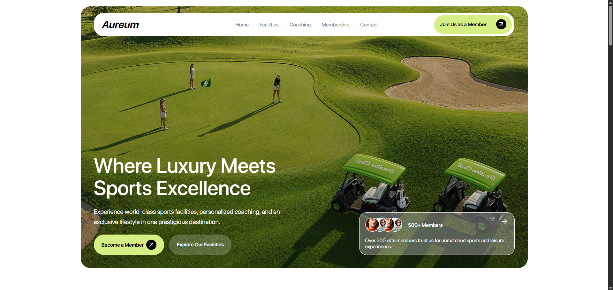
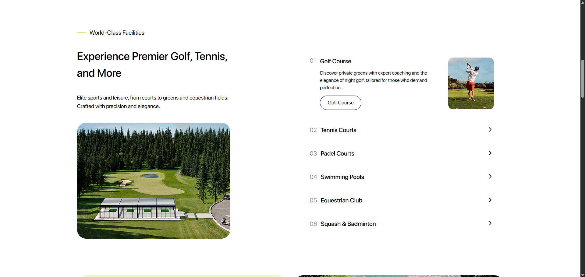
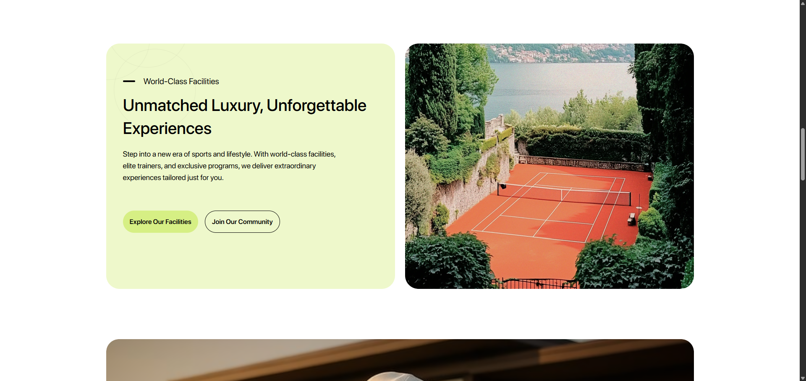
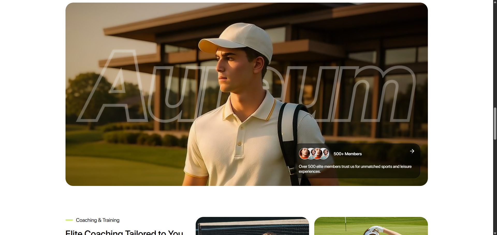
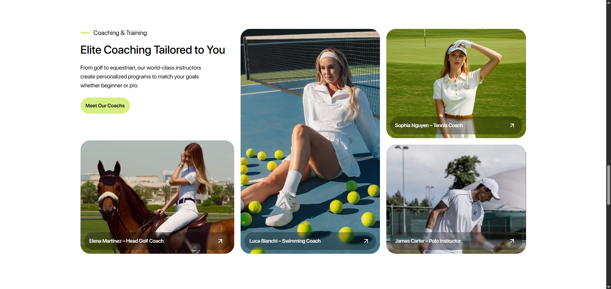
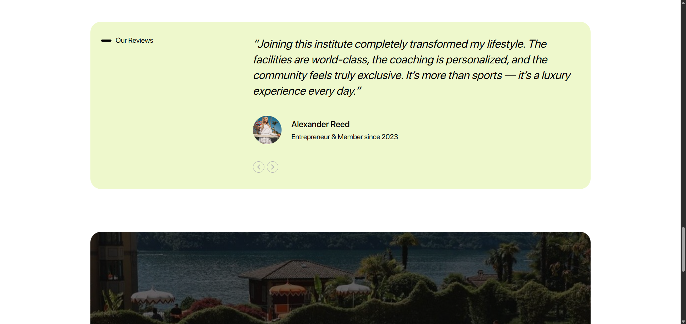
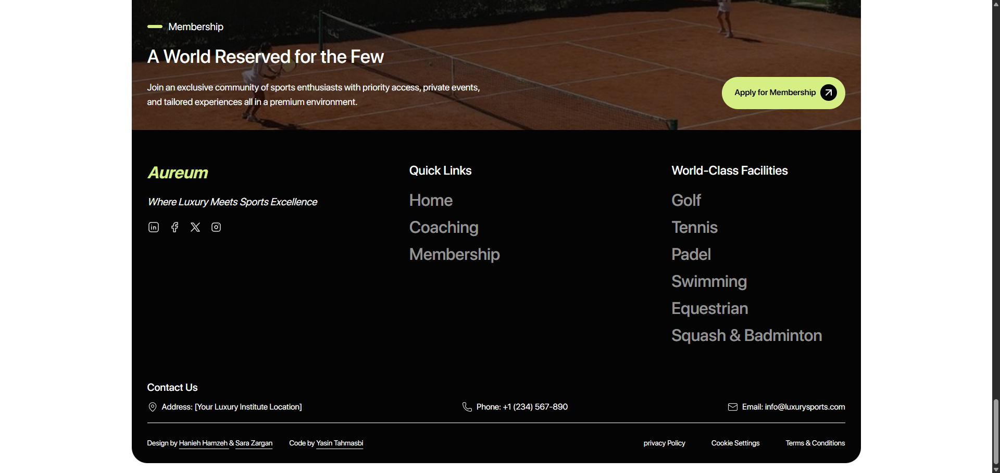

# Aureum - Luxury Sports Club Services

Front-end practice project showcasing a luxury sports club landing page design, crafted with HTML, CSS, Flexbox & Grid.

🔗 [Live Demo](https://yasin-tahmasbi.github.io/Aureum-Luxury-sports-club-services/)

##

I just completed a new practice project 🎯

This project was created in collaboration with two talented UI/UX designers, and I was responsible for front-end development.

My goal for this exercise was to improve my front-end skills and focus on design details.

This project is designed for desktop view only.

## 🛠️ Tech Stack

- HTML5

- CSS3 (Flexbox & Grid)

## 👤 Credits

- **Developed by:** [Yasin Tahmasbi](https://yasintahmasbi.ir/)
- **Design by:** [Hanieh Hamzeh](https://www.linkedin.com/in/haniehamzeh/) & [Sara Zargan](https://www.linkedin.com/in/sara-zargan-80b7b02b6/)
- **Mentorship:** [Parsa Ghorbanian](https://www.instagram.com/parsa_ghorbanian_web/#)
- **Date:** Oct , 2025
## **🔗 Connect with Me**

I'm always happy to connect! Reach out or follow me on:

-  [**Instagram**](https://www.instagram.com/yasin_tahmasbii)
-  [**LinkedIn**](https://www.linkedin.com/in/yasin-tahmasbi)
-  [**GitHub**](https://github.com/yasin-tahmasbi)
-  [**Email**](mailto:yasintahmasb@gmail.com)

## 📷 Preview | Screenshots

